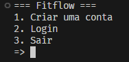
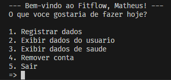

# Projeto final da disciplina de Linguagem de Programação 1
## Objetivo: Sitema de monitoramente de saúde em C++
Um aplicativo que monitora e registra dados de saúde do usuário, como frequência cardíaca, passos e calorias queimadas.
### Menus:

## Membros:
- Clara Nascimento (@Kimitayo)
- José Bernardo (@JoBernardoLB)
- Artur Pinheiro
- Matheus Araújo (@TheMatheusDev)
